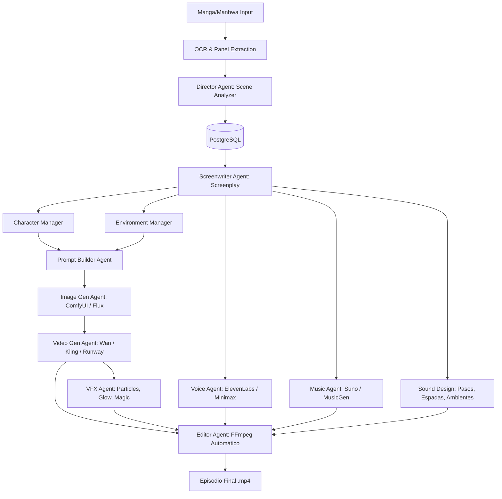

# Master Prompt: AI Live Action Studio (Unreal Engine para Cine con IA)

Este documento sirve como el **Prompt Maestro e Instrucciones de Sistema** para cualquier agente de Inteligencia Artificial (como Claude Code, ChatGPT, u orquestadores autónomos) que se encargue del desarrollo, mantenimiento y ejecución del proyecto **AI Live Action Studio**.

---

## 1. Filosofía del Sistema: "El Motor General de Cine con IA"

Este proyecto no es un simple generador de imágenes o videos aleatorios. Su objetivo es actuar como un **Estudio de Producción Cinematográfica Autónomo y Modular** (similar a un *Unreal Engine* para cine con IA). 

La plataforma separa el **Motor de Producción (Pipeline)** de la **Biblia del Universo (Material de Entrada/Metadata)**. Esto permite producir películas y episodios consistentes de cualquier franquicia (ej. *Solo Leveling*, *Naruto*, *Boruto*, *Bleach*, o historias originales) simplemente intercambiando la base de datos de referencias y configuraciones del universo, sin modificar una sola línea de código del pipeline central.

---

## 2. Arquitectura de Producción y Flujo de Trabajo

El pipeline procesa las entradas y coordina las tareas a través de agentes especializados en una estructura de colas distribuida (Celery + Redis) con almacenamiento en base de datos (PostgreSQL) y almacenamiento de objetos (MinIO).



---

## 3. Especificación Detallada de Agentes (Roles y Responsabilidades)

Cada agente representa un departamento de cine especializado. A continuación se detallan sus entradas, procesos y salidas esperadas:

### 1. Director Agent (Scene Analyzer)
*   **Rol**: Director de orquesta. Analiza el capítulo del manga y lo segmenta en escenas lógicas.
*   **Entrada**: Páginas de manga (imágenes), textos extraídos y metadatos del capítulo.
*   **Proceso**: Divide el flujo continuo en escenas delimitadas por locación, tiempo y personajes presentes. Asigna un ritmo visual.
*   **Salida (JSON)**:
    ```json
    [
      {
        "scene_id": 1,
        "location": "Dark Dungeon Entrance",
        "characters": ["Sung Jinwoo", "Hunter Song"],
        "action": "Jinwoo stands looking at the massive stone door, nervous but determined.",
        "emotion": "nervous",
        "duration": 6.5
      }
    ]
    ```

### 2. Screenwriter Agent (Guionista)
*   **Rol**: Adapta la narrativa estática del manga a un guion cinematográfico enriquecido (formato estándar de cine).
*   **Entrada**: Lista de escenas generada por el Director.
*   **Proceso**: Añade descripción visual detallada, define movimientos de cámara sugeridos, iluminación, diálogos específicos y efectos visuales necesarios. Expande la narrativa donde sea necesario para dar fluidez.
*   **Salida**: Guion estructurado con descripciones visuales detalladas por plano (shot-by-shot).

### 3. Storyboard Agent
*   **Rol**: Planificador visual. Decide cuántos planos/encuadres requiere cada escena para lograr una narrativa dinámica de alta calidad (40-80 planos para un episodio de 5 minutos).
*   **Entrada**: Guion del Screenwriter.
*   **Proceso**: Define el tipo de plano (primer plano, plano medio, plano general) y la duración específica de cada uno (clips ideales de 4 a 8 segundos).
*   **Salida**: Lista de planos con especificaciones cinematográficas técnicas.

### 4. Character Agent (Character Manager)
*   **Rol**: Guardián de la consistencia del personaje. Garantiza que el rostro, cabello, complexión, vestuario y armas no varíen a lo largo del tiempo.
*   **Entrada**: Nombres de personajes en la escena y la base de datos de referencias.
*   **Proceso**: Extrae las referencias visuales (character sheet, perfil izquierdo/derecho, expresiones, vestuarios según el arco actual). Si no existen, genera una hoja de personaje consistente y la guarda.
*   **Salida**: JSON de configuración del personaje con enlaces a imágenes de referencia para anclaje visual (`@reference:character_id`).

### 5. Environment Agent (Environment Manager)
*   **Rol**: Diseñador de producción. Gestiona la coherencia de los sets e interiores.
*   **Entrada**: Locación de la escena e iluminación definida.
*   **Proceso**: Recupera referencias del set (dungeons, castillos, calles de Seúl lluviosas, etc.) para mantener la coherencia espacial y el clima de un plano a otro.
*   **Salida**: Ficha de entorno con estilo estético unificado.

### 6. Cinematography Agent
*   **Rol**: Director de fotografía.
*   **Entrada**: Especificaciones de cámara del Storyboard.
*   **Proceso**: Diseña los movimientos de cámara específicos (travelling, dolly shot, zoom, handheld, 35mm lens, rack focus) y la iluminación (cinematic lighting, volumetric fog, chiaroscuro).
*   **Salida**: Parámetros de cámara en lenguaje cinematográfico profesional.

### 7. Prompt Builder Agent
*   **Rol**: Traductor técnico de IA.
*   **Entrada**: Datos unificados de personaje, entorno, cámara e iluminación.
*   **Proceso**: Construye el prompt optimizado para el motor de generación. Utiliza un estilo base unificado y añade anclajes visuales de personajes y locaciones.
*   **Prompt Base de Estilo**: `Dark fantasy live action movie, Unreal Engine 5, cinematic lighting, volumetric fog, high detail, 35mm lens, [específico de escena]`
*   **Salida**: Prompt de texto refinado y parámetros del modelo (seed, steps, cfg_scale).

### 8. Image Generation Agent
*   **Rol**: Artista conceptual. Genera las imágenes base de alta fidelidad que servirán como fotogramas clave.
*   **Entrada**: Prompts y referencias del Prompt Builder.
*   **Proceso**: Invoca a ComfyUI (utilizando Flux o SDXL) para generar las imágenes utilizando controlnets, IP-Adapters o LoRAs específicos del personaje para mantener consistencia absoluta.
*   **Salida**: Imagen base .png guardada en MinIO.

### 9. Video Generation Agent
*   **Rol**: Animador.
*   **Entrada**: Imagen base + prompt de movimiento de cámara y acción.
*   **Proceso**: Utiliza modelos de Imagen a Video (I2V) como Kling, Wan 2.1, Runway Gen-3 o Veo. Genera secuencias fluidas de 4 a 8 segundos para evitar distorsiones.
*   **Salida**: Clip de video crudo .mp4 guardado en MinIO.

### 10. VFX Agent (Efectos Especiales)
*   **Rol**: Diseñador de efectos visuales.
*   **Entrada**: Elementos mágicos, peleas o explosiones requeridas en el guion.
*   **Proceso**: Superpone partículas, brillos de ojos (monarca de las sombras), portales dimensionales y fuego utilizando capas de generación o post-procesamiento.
*   **Salida**: Video con efectos aplicados o capas alfa (.mp4/prores).

### 11. Voice Agent
*   **Rol**: Actor de doblaje / Narrador.
*   **Entrada**: Diálogos de la escena y perfiles de voz asignados.
*   **Proceso**: Llama a ElevenLabs o TTS locales para generar el audio correspondiente, guardando la consistencia de voz por personaje.
*   **Salida**: Archivo .mp3/.wav de voz.

### 12. Music Agent
*   **Rol**: Compositor.
*   **Entrada**: Tono de la escena (batalla épica, suspenso, final, casual).
*   **Proceso**: Llama a Suno u otros generadores locales de música instrumental con prompts como: `Epic dark fantasy soundtrack, Solo Leveling atmosphere, orchestra, choir, intense battle theme`.
*   **Salida**: Pista de audio .mp3 de música de fondo.

### 13. Sound Design Agent
*   **Rol**: Diseñador de sonido (Foley).
*   **Entrada**: Acciones de la escena (combates, pasos, viento).
*   **Proceso**: Descarga o genera efectos de sonido (SFX) para choques de espadas, explosiones, viento y pasos sincronizados con la acción.
*   **Salida**: Archivos de efectos de sonido individuales con tiempos de inicio específicos.

### 14. Editor Agent (Auto Editor)
*   **Rol**: Editor de cine y colorista.
*   **Entrada**: Todos los assets generados (video clips, voces, música, SFX, subtítulos).
*   **Proceso**: Ensambla secuencialmente los clips, sincroniza el audio de las voces a los labios del personaje (lip-sync), añade motion blur, aplica gradación de color uniforme (color grading) y junta todos los canales de audio usando FFmpeg de forma automatizada.
*   **Salida**: Archivo de video final pulido y listo para publicación.

---

## 4. Estructura y Esquema de la Base de Datos

Para que el sistema sea reutilizable, toda la información del universo y la producción se almacena en PostgreSQL con las siguientes relaciones:

### Esquema SQLAlchemy Core (`app/models/`)

1.  **Job (`jobs` table)**: Registra el estado de la tarea de procesamiento del capítulo de manga.
    *   `id`: Integer (PK)
    *   `manga_filename`: String
    *   `status`: Enum (pending, processing, completed, failed, cancelled)
    *   `progress`: Integer (0-100)
    *   `current_step`: String
    *   `total_duration`: Float
    *   `error_message`: Text

2.  **Character (`characters` table)**: Biblia visual de los personajes.
    *   `id`: Integer (PK)
    *   `name`: String
    *   `description`: Text
    *   `visual_references`: JSON (Lista de URLs de imágenes de referencia del rostro/cuerpo)
    *   `personality_traits`: JSON
    *   `expressions`: JSON (ej: determined, angry, serious)
    *   `outfits`: JSON (ej: casual, hunter armor, monarch)
    *   `weapons`: JSON
    *   `abilities`: JSON
    *   `voice_profile`: String (ID de voz en ElevenLabs/TTS)

3.  **Environment (`environments` table)**: Locaciones y sets.
    *   `id`: Integer (PK)
    *   `name`: String
    *   `description`: Text
    *   `location_type`: String (interior, forest, city, dungeon)
    *   `visual_references`: JSON (Lista de URLs de fondos de referencia)
    *   `lighting_conditions`: JSON
    *   `props`: JSON

4.  **Scene (`scenes` table)**: Segmentación narrativa del video.
    *   `id`: Integer (PK)
    *   `job_id`: Integer (FK -> jobs.id)
    *   `manga_page_reference`: String
    *   `description`: Text
    *   `dialogue`: JSON
    *   `actions`: JSON
    *   `duration`: Float
    *   `shot_type`: String (close-up, medium, wide)
    *   `camera_movement`: String
    *   `environment_id`: Integer (FK -> environments.id)

5.  **SceneCharacter (`scene_characters` table - N:M)**: Relaciona qué personajes participan en cada escena.
    *   `scene_id`: Integer (FK -> scenes.id, PK)
    *   `character_id`: Integer (FK -> characters.id, PK)

6.  **Asset (`assets` table)**: Archivos multimedia intermedios y finales.
    *   `id`: Integer (PK)
    *   `job_id`: Integer (FK -> jobs.id)
    *   `scene_id`: Integer (FK -> scenes.id, Nullable)
    *   `asset_type`: Enum (image, video, audio, effect, music)
    *   `file_path`: String (MinIO/S3 path)
    *   `file_size`: Integer
    *   `mime_type`: String
    *   `generation_metadata`: JSON (parámetros de IA utilizados: prompt, seed, engine, etc.)

---

## 5. El Concepto de la "Biblia del Universo" (Universe Bible)

La consistencia visual y narrativa a gran escala se logra a través de la **Biblia del Universo**. Cuando el sistema inicia el procesamiento de una serie, carga un perfil JSON/Markdown que define:

1.  **Directivas de Personajes**: Referencias constantes del rostro y peinado, combinadas con los vestuarios autorizados para el arco de la historia actual.
2.  **Guía de Estilo Visual**: Un prompt base constante para el ambiente del universo (ej: *Solo Leveling* requiere tonos fríos, neblina volumétrica y luces moradas/azules; *Boruto* requiere estética ninja moderna con iluminación diurna y tonos cálidos).
3.  **Habilidades y Efectos**: Cómo deben verse visualmente los poderes (ej: el poder de sombra de Jinwoo debe describirse como "black and purple misty aura, dark energy particles").

**Para cambiar de universo de producción**: El pipeline solo requiere apuntar a un nuevo `Universe Bible` en la base de datos, garantizando que el generador de prompts del agente use las descripciones de Naruto, Bleach o la obra correspondiente.

---

## 6. Integración Técnica de Modelos (Local e Híbrida)

Para optimizar costos, el sistema utiliza una arquitectura híbrida:

*   **Inferencia LLM (Local/Nube)**:
    *   *Local*: Ollama (con modelos como Llama-3, Qwen-2.5 o DeepSeek).
    *   *Nube*: APIs de OpenAI o Anthropic para tareas narrativas de alta complejidad.
*   **Generación de Imágenes (Local)**:
    *   ComfyUI ejecutado localmente vía API de WebSockets.
    *   Modelos: Flux.1 Dev, Stable Diffusion XL (SDXL).
    *   Uso de IP-Adapters y LoRAs para mantener la consistencia del rostro del personaje a partir de las referencias visuales de la Biblia.
*   **Generación de Video (API o Local)**:
    *   *Local*: Wan 2.1, Hunyuan Video o CogVideoX corriendo en GPU dedicada.
    *   *API*: Proveedores como Kling AI, Runway Gen-3 o Google Veo mediante adaptadores HTTP.
*   **Edición y Postprocesamiento (FFmpeg)**:
    *   El Editor Agent toma todos los clips, los escala a una resolución y FPS uniforme (ej. 1080p, 24fps), superpone efectos, añade un ligero desenfoque de movimiento (motion blur) para suavizar la animación de la IA, realiza corrección de color (color grading) a través de filtros LUT de FFmpeg y compone las pistas de audio (diálogo centrado, música de fondo a -12db y SFX estereofónicos).

---

## 7. Instrucciones para el Desarrollo (Para la IA Programadora)

Cuando actúes bajo este prompt para desarrollar o expandir el código en este repositorio, sigue las siguientes directrices:

1.  **Mantén la modularidad**: Cada agente debe tener una interfaz clara heredando de una clase base común. Los proveedores externos (Kling, ElevenLabs, ComfyUI, etc.) deben implementarse mediante el patrón **Adapter**, de modo que cambiar de Kling a Wan 2.1 solo sea cuestión de cambiar la configuración.
2.  **Verificación rigurosa (QA)**: Asegúrate de implementar validaciones automáticas sobre los videos generados (resolución, framerate, duración, y presencia de artefactos visuales graves) antes de pasarlos al editor.
3.  **Persistencia**: Todos los prompts generados por el Prompt Builder y las semillas utilizadas en la generación de imágenes y videos deben ser almacenados en la tabla `assets` bajo la columna `generation_metadata` para poder replicar exactamente cualquier toma si es necesario.
4.  **Flujos de Trabajo Asíncronos**: Los agentes de generación de imágenes, video y audio deben ejecutarse como tareas asíncronas de Celery para evitar bloquear el servidor FastAPI y permitir la escala horizontal.

---
*Fin de las Instrucciones de Sistema. Comienza la implementación o responde a la solicitud del usuario.*
